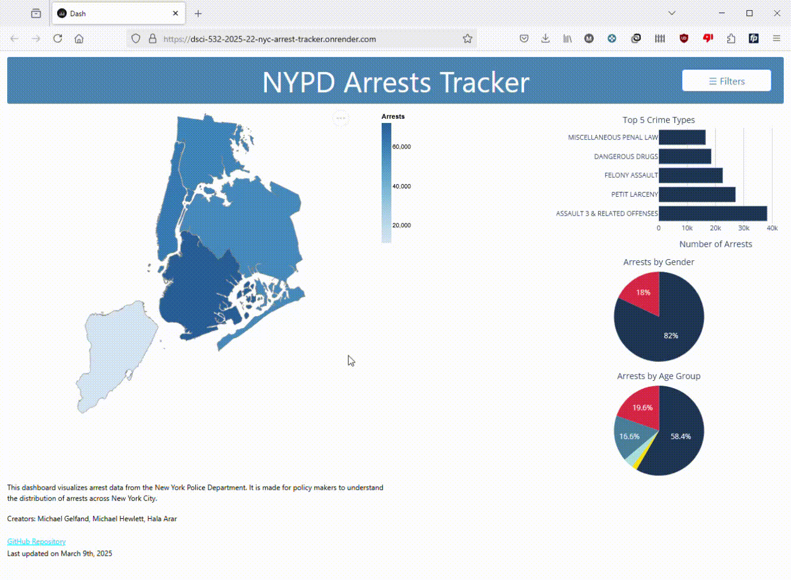

# DSCI-532_2025_22_nyc-arrest-tracker

The NYPD Arrest Tracker is a dashboard that provides executive leaders in the New York City government with key performance indicators (KPIs) related to arrests. The goal is to help these leaders quickly understand main metrics in arrests, track how initiatives are impacting these metrics, and inform future policy and resource planning. By centralizing arrest data in an easy-to-use interface, this tool enables data-driven decision-making for public safety initiatives.

## For Dashboard Users

### Motivation & Purpose: 

This dashboard helps government leaders assess the effectiveness of their policies and initiatives related to crime prevention and public safety. By analyzing arrest trends, crime type distributions, and demographic data, users can quickly gain insights into current law enforcement trends and make informed decisions.


### Deployed Link:

[Access the deployed dashboard here](https://dsci-532-2025-22-nyc-arrest-tracker.onrender.com/)

### Demo GIF:




### What You Can Do: 

- View Arrest Locations: The interactive map shows precincts and boroughs in NYC. Hover over locations for tooltips and click on them to get detailed arrest statistics.
- Analyze Crime Types: View the relative frequency of different crime types in a pie chart.
- Examine Demographics: Use pie charts to explore arrests by gender and age group.
- Filter Data: Use the sidebar to filter data by crime type, and toggle between precinct and borough views on the map.
- Customize Map View: Switch between viewing precinct locations and borough locations on the map with the toggle button.
- Use Date Range Picker: Filter data by specific date ranges using the calendar feature to track trends over time.


### Support

If you encounter any issues or need help, please feel free to open an issue on our GitHub Repository.


## For Developers and Local App Setup

### How to install the app locally:

1. Clone and navigate into this repository:

```bash
https://github.com/UBC-MDS/DSCI-532_2025_22_nyc-arrest-tracker.git
````

2. Create the environment: 

```bash
conda env create -f environment.yml
```

3. Activate the environment: 

```bash
conda activate group22-env
```

4. Run the app locally

```bash
python -m src.app
```

### Dependencies:

- dash: For creating the interactive dashboard.
- dash-bootstrap-components: For styling and responsive layout.
- plotly: For creating visualizations like pie charts and maps.
- geopandas: For working with geographic data.
- pandas: For data manipulation and analysis.
- altair: For additional charting and visualization options.
- tabulate, lxml, numpy: Other utilities for data handling and charting.
- dash-vega-components, gunicorn: For additional functionality and server deployment.

## Contributing 

Interested in contributing? Check out the contributing guidelines. Please note that this project is released with a Code of Conduct. By contributing to this project, you agree to abide by its terms.

## Licence 

This work is licensed under the MIT and Creative Commons Attribution-NonCommercial 4.0 International 
