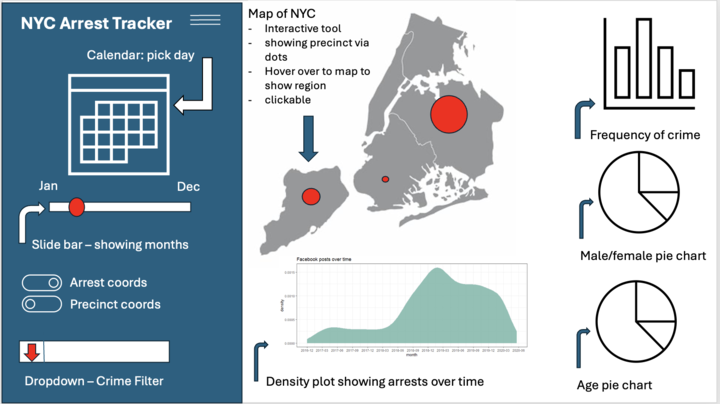

# NYPD Arrest Tracker App Proposal

**Authors**: Michael Gelfand, Hala Arar, Michael Hewlett

## Motivation and Purpose

### Target Audience

Executive leadership in the NYC government

### Project Authors

External data science consultancy

### Problem

The target audience wants to follow best practice in evidence-based policy. They have identified that key arrest statistics are an important outcome for several departments and initiatives. In the past each department relied on separate dashboards but to avoid reduplicated effort and reference a single set of metrics, an initiative was struck to develop a unified dashboard.

They have brought on our firm to build an easily and quickly digestible dashboard on arrests in NYC. They want to will use this dashboard to track the effect of their ongoing initiatives and to develop ideas for new projects.

## Description of the Data

We will be using New York Police Department (NYPD) arrest record data to create visualizations, which could influence policy decisions. The dataset consists of 170,095 arrests during 2023. The data was obtained from the [NYPD Arrests Dataset (2023)](https://www.kaggle.com/datasets/justinpakzad/nypd-arrests-2023-dataset) dataset on Kaggle, which was sourced from [NYC Public Data](https://data.cityofnewyork.us/d/8h9b-rp9u). Each arrest record has 18 variables associated with it, which will we use to display the key information present in the data. These variables fall into the following groupings:

- **Arrest Information**: This includes the arrest date, time, and location.
- **Arrestee Information**: This includes age group, and sex of the arrestee.
- **Arrest Charges**: This includes the charges for which the arrestee was arrested.

We will use this data to create visualizations that will help us understand the distribution of arrests across different age groups, different charges, different locations around New York City. This will help us identify patterns and trends in the data, which could be useful for policy decisions.

## Research Questions and Usage Scenarios

### Persona Description

Name: John Doe
Role: Executive Leader, New York City Government
Background: John oversees public safety initiatives and uses data to assess the effectiveness of law enforcement programs. He focuses on policy, resource allocation, and crime reduction strategies.

### Overall Goal

John’s goal is to quickly access arrest metrics to evaluate initiatives, track crime trends, identify demographic and borough disparities, and inform future policy and resource allocation.

### User Story

John logs into the dashboard to track the latest trends in arrests across New York City. He is particularly interested in understanding how arrest numbers are changing over time and whether there is a shift in the types of crimes being committed. 

His key tasks include:

- [Exploring] arrest trends by selecting specific days and months from the side menu. He can choose whether to display arrest coordinates or precinct coordinates on the interactive map.

- [Filtering] data by crime type using the dropdown menu to view specific categories such as assault, larceny, or drug-related crimes.

- [Examining] arrest patterns by borough or precinct. By clicking on specific regions on the interactive map, John can view a summary of arrests and crime types within those areas.

- [Tracking] arrest trends over time through the time-series density chart. This chart allows him to see how arrests have changed in recent months, and he can modify the time range using the sidebar.

- [Analyzing] the distribution of arrests by crime type with the bar chart to identify which offenses are most frequent.

- [Comparing] arrest data by gender and age group with interactive pie charts. These charts allow John to filter data and explore demographic patterns in the arrest data.

The dashboard includes:

- Side menu: Select day, month, crime type, and map coordinates.

- An interactive map of New York City that displays points corresponding to precincts. John can hover over the map and click on boroughs or precincts to view a summary of the arrest data for those regions.

- A time-series density chart that shows trends in arrests over the past few months. This chart is fully interactive, and John can modify it using the sidebar to adjust the time range and explore different patterns.

- Bar chart: Display the frequency of various crime types (e.g., assault, larceny, drug-related offenses), giving John a clear view of the distribution of crimes.

- Two pie charts: one comparing arrest data by gender and the other by age group. 

Based on this information, John might decide that the recent community outreach initiative in specific boroughs is working effectively. However, he may also realize that there is an increasing trend in drug-related offenses and that additional resources are needed to address these crimes. He will likely bring this data to the next executive meeting to discuss potential new strategies for combating drug-related crimes in the city.

This process allows John to make data-driven decisions, informing his strategy for future policies, resource allocation, and crime prevention efforts.

## App Sketch and Description

*Figure 1: Preliminary Sketch of the NYPD Arrest Tracker App*

The app will contain a landing page with the main component being a map of New York City in the center of the page. The map will be interactive and will allow users to click on different precincts to view the number of arrests made by the NYPD in that precinct. The map will also have a tooltip that will show the number of arrests made in a precinct when the user hovers over it. To complement this map, there will be a bar chart that will show the number of arrests made by the NYPD for each crime type. The bar chart will be interactive and will allow users to click on a bar to view the breakdown of each crime into its subcategories (i.e. assult into assault 1, 2, 3 etc.). The app will also contain 2 pie charts that will show the distribution of arrests made by the arrestees age and sex. The bar chart and the 2 pie charts will be located on the right side of the landing page. Below the map, there will be a density plot showing arrests over time, from the start of 2023 until the end of 2023. There will additionally be a collapsable menu on the left side of the page with options to filter the data by a specific day or month, and by crime type. There will also be a toggle switch to switch between displaying arrest locations or precint locations on the map.
